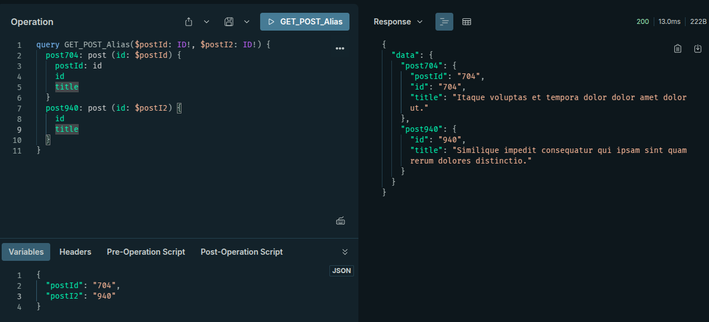
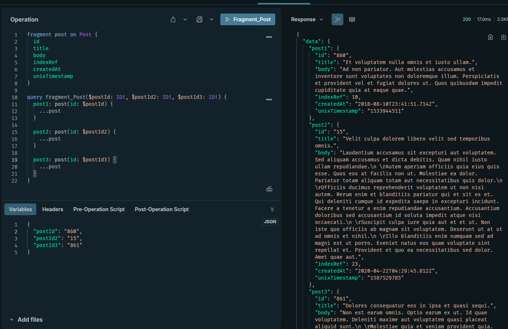
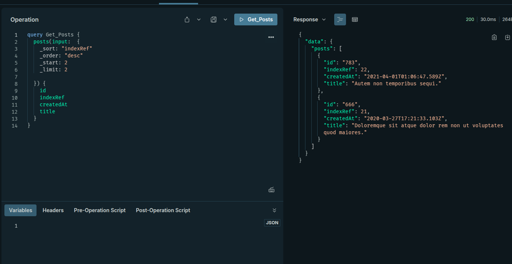
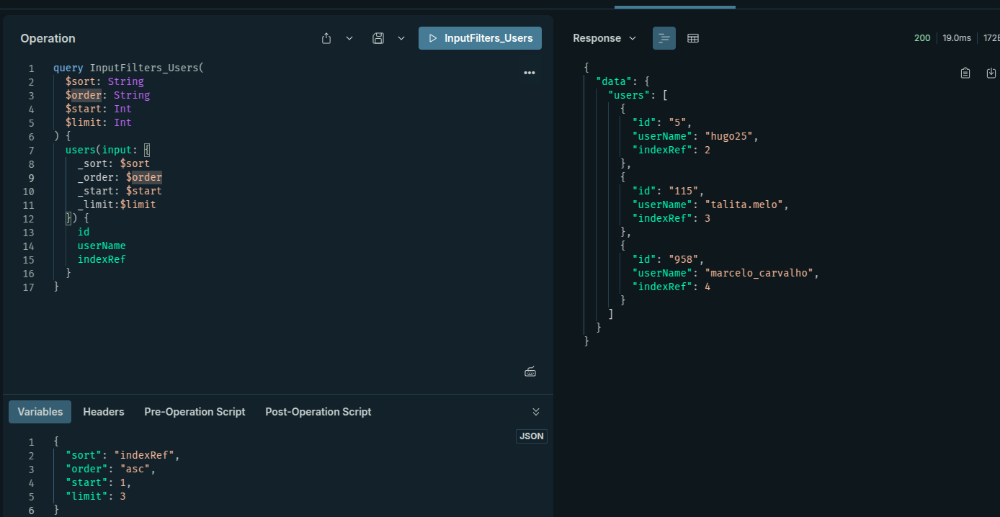
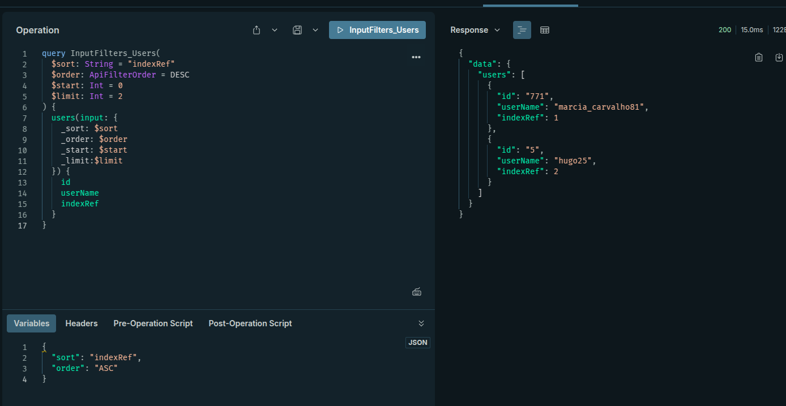
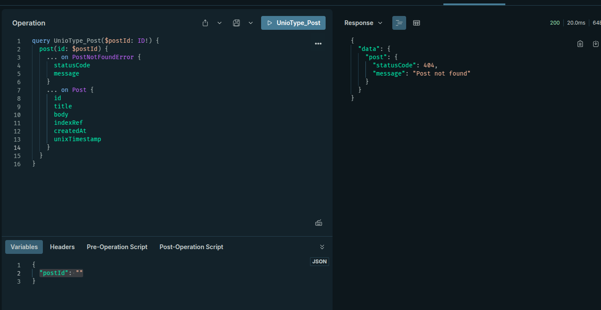
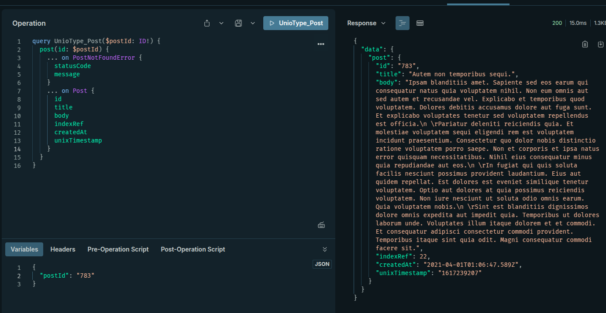
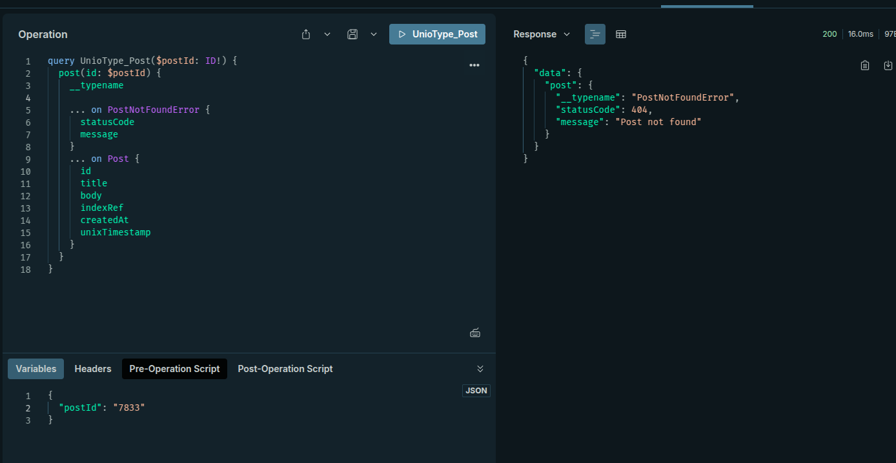

## Querys com dados renomeados

```
query GET_POST {
  post343: post(id: "343") {
    postId: id
    id
    title
    ...
  }
  post860: post(id: "860") {
    id
    title
    ...
  }
}
```



## Query Frgaments - Evite repeticoes nas consultas

```
fragment post on Post {
  id
  title
  body
  indexRef
  createdAt
  unixTimestamp
}

query Fragment_Post($postId: ID!, $postId2: ID!, $postId3: ID!) {
  post1: post(id: $postId) {
    ...post
  }

  post2: post(id: $postId2) {
    ...post
  }

  post3: post(id: $postId3) {
    ...post
  }
}
```




## Input Type




## ENUM

typedefs.js

```
import { gql } from 'apollo-server';

export const apiFiltersTypeDefs = gql`
  input ApiFiltersInput {
    _sort: String
    _order: ApiFilterOrder
    _start: Int
    _limit: Int
  }

  enum ApiFilterOrder {
    ASC
    DESC
  }
`;
```

resolvers.js

```
export const apiFiltersRersolvers = {
  ApiFilterOrder: {
    ASC: 'asc',
    DESC: 'desc',
  },
};

```

```
import { gql } from 'apollo-server';
import { userTypesDefs } from './user/typedefs.js';
import { userResolvers } from './user/resolvers.js';
import { postTypeDefs } from './post/typedefs.js';
import { postResolvers } from './post/resolvers.js';
import { apiFiltersTypeDefs } from './api-filters/typedefs.js';
import { apiFiltersRersolvers } from './api-filters/resolvers.js';

const rootType = gql`
  type Query {
    _empty: Boolean
  }
`;

const rootResolver = {
  Query: {
    _empty: () => true,
  },
};

export const typeDefs = [
  rootType,
  userTypesDefs,
  postTypeDefs,
  apiFiltersTypeDefs,
];
export const resolvers = [
  rootResolver,
  userResolvers,
  postResolvers,
  apiFiltersRersolvers,
];
```



## Union Types

typedefes:

```
import { gql } from 'apollo-server';

export const postTypeDefs = gql`
  extend type Query {
    post(id: ID!): PostResult
    posts(input: ApiFiltersInput): [Post!]!
  }

  union PostResult = PostNotFoundError | Post

  type PostNotFoundError {
    statusCode: Int!
    message: String!
  }

  type Post {
    id: ID!
    title: String!
    body: String!
    # userId: String!
    indexRef: Int!
    createdAt: String!
    # user: User!
    unixTimestamp: String!
  }
`;
```

resolvers:

```
const posts = async (_, { input }, { getPosts }) => {
  const apiFiltersInput = new URLSearchParams(input).toString();
  const posts = await getPosts(apiFiltersInput);
  return posts.json();
};

const post = async (_, { id }, { getPosts }) => {
  const response = await getPosts(id);
  const post = await response.json();
  if (!post.id) {
    return {
      statusCode: 404,
      message: 'Post not found',
    };
  }
  return post;
};

export const postResolvers = {
  Query: {
    posts,
    post,
  },
  Post: {
    unixTimestamp: (parent) => {
      return Math.floor(new Date(parent.createdAt).getTime() / 1000);
    },
  },
  PostResult: {
    __resolveType: (obj) => {
      if (obj.id) return 'Post';
      if (obj.statusCode) return 'PostNotFoundError';
      return null;
    },
  },
};
```




